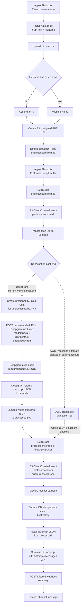

# Voice Memo Transcription Flow

```mermaid
flowchart TD
  A[Apple Shortcuts<br/>Record voice memo] --> B[POST /upload-url<br/>x-api-key + fileName]

  B --> C[UploadUrl Lambda]
  C --> D{fileName has extension?}
  D -- No --> E[Append .m4a]
  D -- Yes --> F[Keep fileName]
  E --> G[Create S3 presigned PUT URL]
  F --> G

  G --> H[Return uploadUrl + key<br/>unprocessed/file.m4a]

  H --> I[Apple Shortcuts<br/>PUT audio to uploadUrl]
  I --> J[S3 Bucket<br/>unprocessed/file.m4a]

  J --> K[S3 ObjectCreated event<br/>prefix unprocessed/]
  K --> L[Transcription Starter Lambda]

  L --> M{Transcription backend}

  M -- Deepgram<br/>current working backend --> P[Create presigned S3 GET URL<br/>for unprocessed/file.m4a]
  P --> Q[POST remote audio URL to Deepgram /v1/listen<br/>model=nova-3<br/>diarize=true<br/>utterances=true]
  Q --> R[Deepgram pulls audio<br/>from presigned GET URL]
  R --> S[Deepgram returns transcript JSON<br/>to Lambda]
  S --> T[Lambda writes transcript JSON<br/>to processed path]
  T --> O[S3 Bucket<br/>processed/file/object-id/transcript.json]

  M -. AWS Transcribe alternate<br/>blocked in current account .-> N[AWS Transcribe<br/>diarization job]
  N -. writes JSON if account enabled .-> O

  O --> U[S3 ObjectCreated event<br/>prefix processed/<br/>suffix transcript.json]
  U --> V[Discord Notifier Lambda]
  V --> W[DynamoDB idempotency claim<br/>bucket/key]
  W --> X[Read transcript JSON<br/>from processed/]
  X --> Y[Summarize transcript<br/>with Anthropic Messages API]
  Y --> AA[POST Discord webhook<br/>summary]
  AA --> AB[Discord channel message]
```
